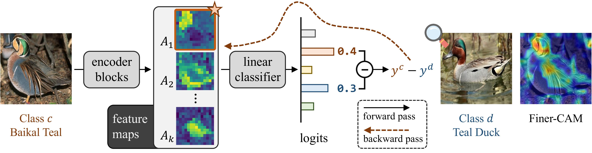

# Finer-CAM : Spotting the Difference Reveals Finer Details for Visual Explanation [CVPR 2025]
Official implementation of "Finer-CAM [[arxiv]](https://arxiv.org/pdf/2501.11309)".

CAM methods highlight image regions influencing predictions but often struggle in fine-grained tasks due to shared feature activation across similar classes. We propose **Finer-CAM**, which explicitly compares the target class with similar ones, suppressing shared features and emphasizing unique, discriminative details.

Finer-CAM retains CAM’s efficiency, offers precise localization, and adapts to multi-modal zero-shot models, accurately activating object parts or attributes. It enhances explainability in fine-grained tasks without increasing complexity.



## Demo 
Experience the power of Finer-CAM with our interactive demos! Witness **accurate localization** of discriminative features.

- 	Try the **multi-modal** demo and see how Finer-CAM activates detailed and relevant regions for diverse concepts: [](https://colab.research.google.com/drive/1plLrL7vszVD5r71RGX3YOEXEBmITkT90?usp=sharing)
- Test the **classifier** demo to explore class-specific activation maps with enhanced explainability: [](https://colab.research.google.com/drive/1SAjRTmGy31G-GjtAc9pVH6isPjm1hWsj?usp=sharing)

## Reqirements

```
pip install grad-cam
```


## Preparing Datasets
### Stanford Cars
1. **Download the dataset** using the following command:

   ```bash
   curl -L -o datasets/stanford_cars.zip \
   https://www.kaggle.com/api/v1/datasets/download/cyizhuo/stanford-cars-by-classes-folder


2. **Unzip the downloaded file** 
   ```bash
   unzip datasets/stanford_cars.zip -d datasets/

3. The structure of `datasets/`should be organized as follows:

```
datasets/
├── train/
│   ├── Acura Integra Type R 2001/
│   │   ├── 000405.jpg
│   │   ├── 000406.jpg
│   │   └── ...
│   ├── Acura RL Sedan 2012/
│   │   ├── 000090.jpg
│   │   ├── 000091.jpg
│   │   └── ...
│   └── ...
└── test/
    ├── Acura Integra Type R 2001/
    │   ├── 000450.jpg
    │   ├── 000451.jpg
    │   └── ...
    ├── Acura RL Sedan 2012/
    │   ├── 000122.jpg
```


## Usage

### Step 1. Generate CAMs for Validation Set

 **Run the Script:**

   - Execute the `generate_cam.py` script with the appropriate arguments using the following command:
     ```bash
      python generate_cam.py \
          --classifier_path <path_to_classifier_weight> \
          --dataset_path <path_to_dataset_or_image_list> \
          --save_path <path_to_save_results>
     ```


### Step 2. Visualize Results

 **Run the Script:**

   - Execute the `visualize.py` script with the appropriate arguments using the following command:
     ```bash
     python visualize.py --dataset_path <path_to_dataset_directory> \
                         --cams_path <path_to_cams_directory> \
                         --save_path <path_to_save_visualizations>
     ```


## Acknowledgement

We utilized code from:

- [pytorch_grad_cam](https://github.com/jacobgil/pytorch-grad-cam/tree/61e9babae8600351b02b6e90864e4807f44f2d4a)  
- [clip-es](https://github.com/linyq2117/CLIP-ES)  

Thanks for their wonderful works.


# Citation [](https://arxiv.org/abs/2501.11309)
If you find this repository useful, please consider citing our work :pencil: and giving a star :star2: :
```
@article{zhang2025finer,
  title={Finer-CAM: Fine-grained Visual Interpretability through Class-Specific Gradient Refinements},
  author={Ziheng Zhang and Jianyang Gu and Arpita Chowdhury and Zheda Mai and David Carlyn and Tanya Berger-Wolf and Yu Su and Wei-Lun Chao},
  journal={arXiv preprint arXiv:2501.11309},
  year={2025},
}
```
