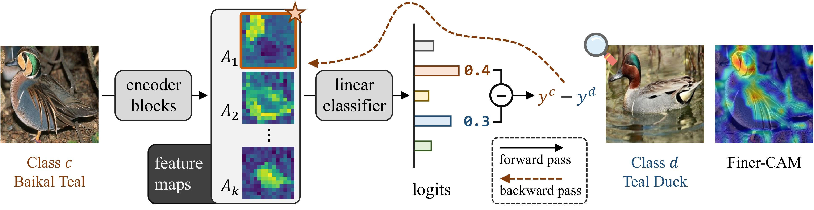

# Finer-CAM : Spotting the Difference Reveals Finer Details for Visual Explanation [CVPR 2025]
Official implementation of "Finer-CAM [[arxiv]](https://arxiv.org/pdf/2501.11309)".

CAM methods highlight image regions influencing predictions but often struggle in fine-grained tasks due to shared feature activation across similar classes. We propose **Finer-CAM**, which explicitly compares the target class with similar ones, suppressing shared features and emphasizing unique, discriminative details.

Finer-CAM retains CAM’s efficiency, offers precise localization, and adapts to multi-modal zero-shot models, accurately activating object parts or attributes. It enhances explainability in fine-grained tasks without increasing complexity.


## Update

- **2026.04.19**: Added a new Colab tutorial for using customized data: [Finer-CAM Tutorial](https://colab.research.google.com/drive/1Sd6X96rSx6jybG0GHHFr_1yymhFFdGRc?usp=sharing)
- **2026.04.14**: Added a new Hugging Face demo for the CUB classifier: [Finer-CAM Demo](https://huggingface.co/spaces/ZihengZ/FinerCAM)
- **2025.03.13**: Merged into [`jacobgil/pytorch-grad-cam`](https://github.com/jacobgil/pytorch-grad-cam), a wonderful library that supports multiple CAM-based methods.

## Demo 
Experience the power of Finer-CAM with our interactive demos! Witness **accurate localization** of discriminative features.

- Try the **multi-modal** demo and see how Finer-CAM activates detailed and relevant regions for diverse concepts:  
  [](https://colab.research.google.com/drive/1plLrL7vszVD5r71RGX3YOEXEBmITkT90?usp=sharing)

- Test the **CUB classifier** demo to visualize fine-grained, discriminative traits with enhanced interpretability:  
   [](https://huggingface.co/spaces/ZihengZ/FinerCAM)

- Try the **Colab tutorial** and try Finer-CAM on your own data:  
  [](https://colab.research.google.com/drive/1Sd6X96rSx6jybG0GHHFr_1yymhFFdGRc?usp=sharing)

## Requirements

Install the dependencies from this repo:

```bash
pip install -r requirements.txt
```

Run scripts and notebooks from the repository root so Python imports the local
`pytorch_grad_cam` package in this tree.


## Usage

### Python API

`FinerCAM` is available from `pytorch_grad_cam` and wraps an existing CAM
backend such as `GradCAM`. It keeps the normal CAM pipeline for collecting
activations and gradients, but replaces the optimization target with the
Finer-CAM objective.

```python
from pytorch_grad_cam import FinerCAM, GradCAM

cam = FinerCAM(
    model=model,
    target_layers=target_layers,
    reshape_transform=reshape_transform,  # optional
    base_method=GradCAM,
)
```

Call `FinerCAM` with:

- `input_tensor`: input batch passed to the model.
- `targets`: optional list of `pytorch_grad_cam` target callables. See
  [model_targets](./pytorch_grad_cam/utils/model_targets.py). If `None`, Finer-CAM targets are
  constructed automatically based on the model outputs.
- `target_size`: optional output size used when resizing CAM maps.
- `eigen_smooth`: enables eigenvalue-based smoothing in the wrapped CAM method.
- `alpha`: scaling factor used by `FinerWeightedTarget` for penalizing
  reference categories.
- `reference_category_ranks`: ranks from the similarity-sorted category list
  used to choose reference categories when `targets=None`. The default
  `[1, 2, 3]` uses the second to fourth most similar categories as references.
  If a requested rank exceeds the number of available classes, it is ignored.
- `target_idx`: the index of the target category, usually the ground-truth
  category. If omitted, the highest-scoring category in each sample is used.
- `H`, `W`: optional feature-grid height and width for backbones that need them
  in the activation/gradient path, such as ViT-style reshape transforms.

`FinerCAM.forward(...)` returns a tuple:

```python
cam_map, outputs, main_categories, references = cam(
    input_tensor=input_tensor,
    targets=None,
    alpha=1.0,
    reference_category_ranks=[1, 2, 3],
    target_idx=target_idx,
    H=grid_height,
    W=grid_width,
)
```

- `cam_map`: aggregated CAM map from the wrapped backend.
- `outputs`: raw model outputs from the forward pass.
- `main_categories`: automatically selected main category per sample when
  `targets=None`.
- `references`: automatically selected reference categories per sample when
  `targets=None`.

When `targets=None`, Finer-CAM computes a similarity ranking by sorting class
logits according to their absolute distance from the reference logit. The
closest class becomes the main category and the selected
`reference_category_ranks` become the reference set.

### `FinerWeightedTarget`

Automatic target construction uses `FinerWeightedTarget`, which implements the
weighted relative objective used by Finer-CAM. For a main category `n` and a
reference set `i`, it computes

`sum_i p_i * (w_n - alpha * w_i) / (sum_i p_i + 1e-9)`

where `w_n` is the main-category logit, `w_i` are the reference-category
logits, and `p_i` are the softmax probabilities of the reference categories.
This keeps evidence for the main class while suppressing shared evidence from
similar classes. If a reference category index exceeds the number of available
classes, it is ignored. If no valid reference categories remain, the target
falls back to the main-category score.

You can also provide targets manually:

```python
from pytorch_grad_cam.utils.model_targets import FinerWeightedTarget

targets = [
    FinerWeightedTarget(
        main_category=target_idx,
        reference_categories=[similar_idx_1, similar_idx_2, similar_idx_3],
        alpha=1.0,
    )
]

cam_map, outputs, _, _ = cam(
    input_tensor=input_tensor,
    targets=targets,
)
```

### Step 1. Generate CAMs for Validation Set

 **Run the Script:**

   - Execute the `generate_cams.py` script with the appropriate arguments using the following command:
     ```bash
      python generate_cams.py \
          --classifier_path <path_to_classifier_weight> \
          --dataset_path <path_to_dataset_or_image_list> \
          --save_path <path_to_save_results>
     ```

   - In order to get a classifier, please refer to [placeholder].


### Step 2. Visualize Results

 **Run the Script:**

   - Execute the `visualize.py` script with the appropriate arguments using the following command:
     ```bash
     python visualize.py --dataset_path <path_to_dataset_directory> \
                         --cams_path <path_to_cams_directory> \
                         --save_path <path_to_save_visualizations>
     ```


## Example Dataset Preparation
### Stanford Cars
1. **Download the dataset** using the following command:

   ```bash
   curl -L -o datasets/stanford_cars.zip \
   https://www.kaggle.com/api/v1/datasets/download/cyizhuo/stanford-cars-by-classes-folder


2. **Unzip the downloaded file** 
   ```bash
   unzip datasets/stanford_cars.zip -d datasets/

3. The structure of `datasets/`should be organized as follows:

```
datasets/
├── train/
│   ├── Acura Integra Type R 2001/
│   │   ├── 000405.jpg
│   │   ├── 000406.jpg
│   │   └── ...
│   ├── Acura RL Sedan 2012/
│   │   ├── 000090.jpg
│   │   ├── 000091.jpg
│   │   └── ...
│   └── ...
└── test/
    ├── Acura Integra Type R 2001/
    │   ├── 000450.jpg
    │   ├── 000451.jpg
    │   └── ...
    ├── Acura RL Sedan 2012/
    │   ├── 000122.jpg
```


## Acknowledgement

We utilized code from:

- [pytorch_grad_cam](https://github.com/jacobgil/pytorch-grad-cam/tree/61e9babae8600351b02b6e90864e4807f44f2d4a)  
- [clip-es](https://github.com/linyq2117/CLIP-ES)  

Thanks for their wonderful works.


# Citation [](https://arxiv.org/abs/2501.11309)
If you find this repository useful, please consider citing our work :pencil: and giving a star :star2: :
```
@InProceedings{zhang2025finer,
    author    = {Zhang, Ziheng and Gu, Jianyang and Chowdhury, Arpita and Mai, Zheda and Carlyn, David and Berger-Wolf, Tanya and Su, Yu and Chao, Wei-Lun},
    title     = {Finer-CAM: Spotting the Difference Reveals Finer Details for Visual Explanation},
    booktitle = {Proceedings of the Computer Vision and Pattern Recognition Conference (CVPR)},
    month     = {June},
    year      = {2025},
    pages     = {9611-9620}
}
```
